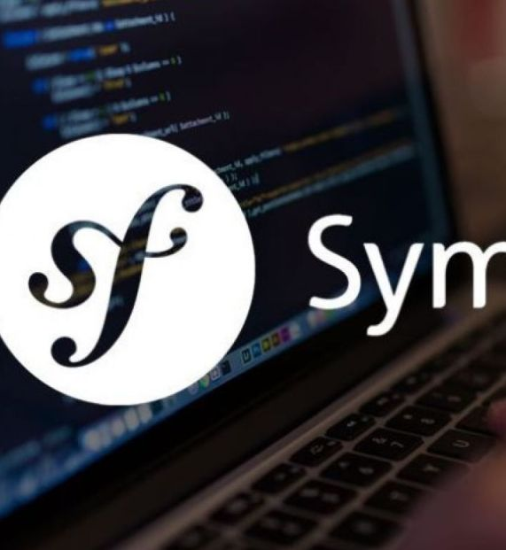

# MVC report
My symfony site for a course in Sweden.

## How to clone
`git clone https://github.com/fiwr23/mvc-report

## How to install

1. Se till att du har över php 8.3 installerat.
2. Klona/ladda ner zip av det här repot.
3. I root mappen kör composer install.
4. Kör sedan composer update.
5. Kör sedan npm install.

